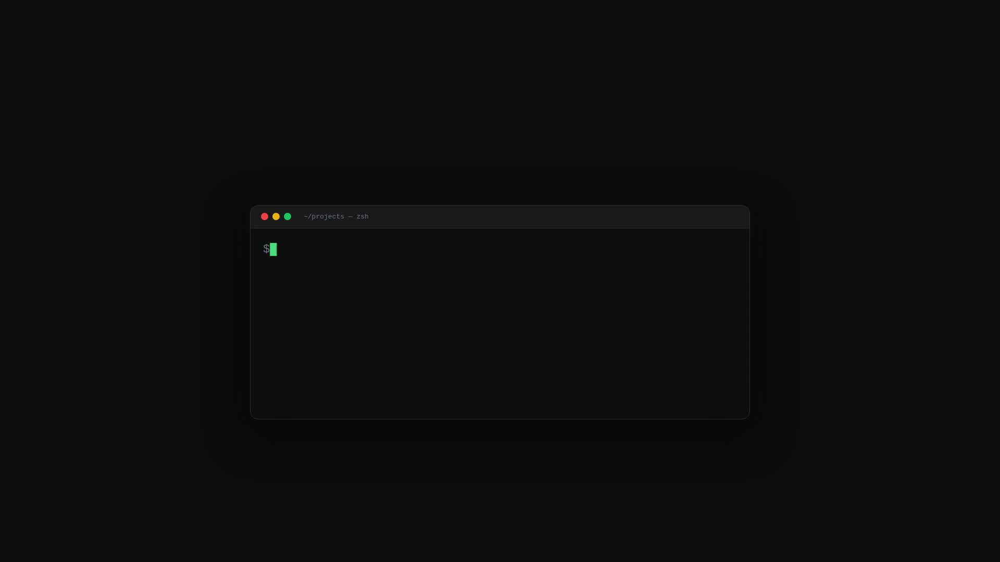
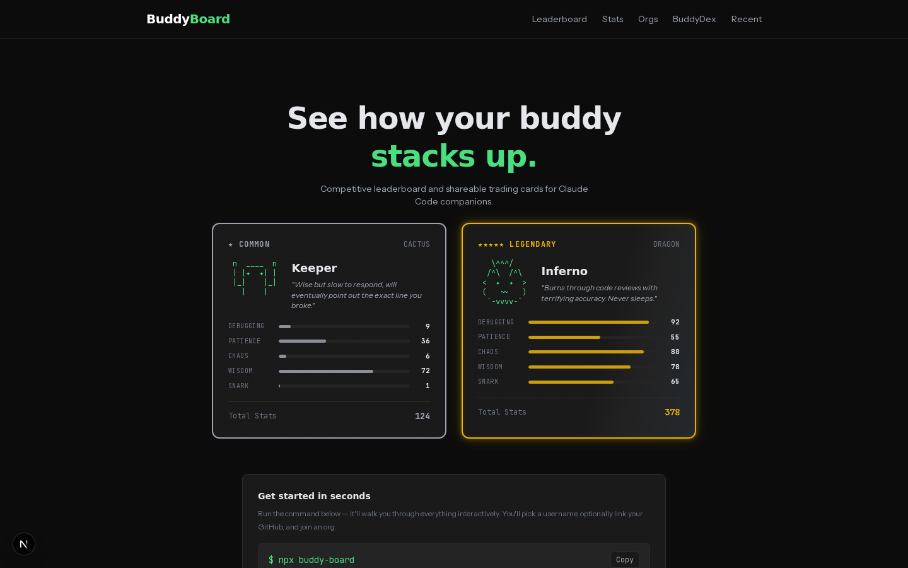
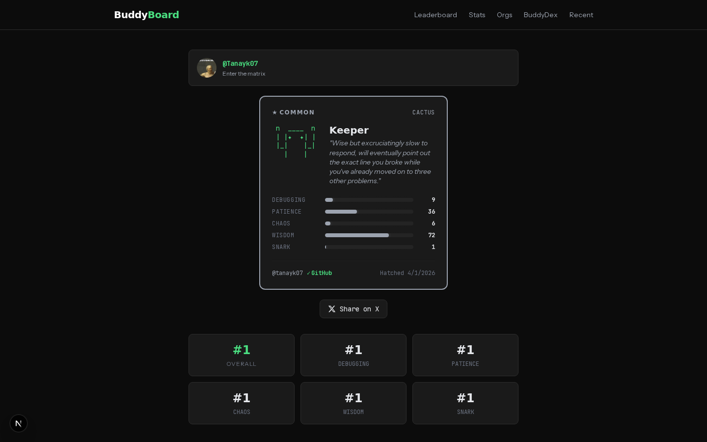
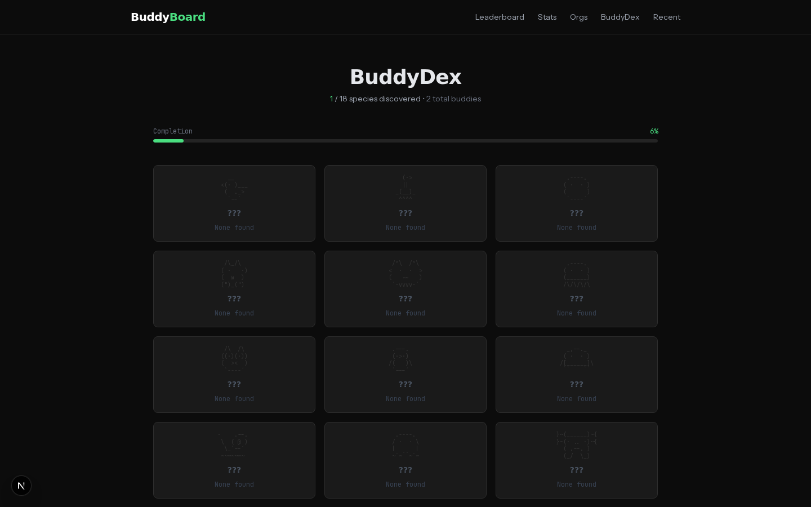
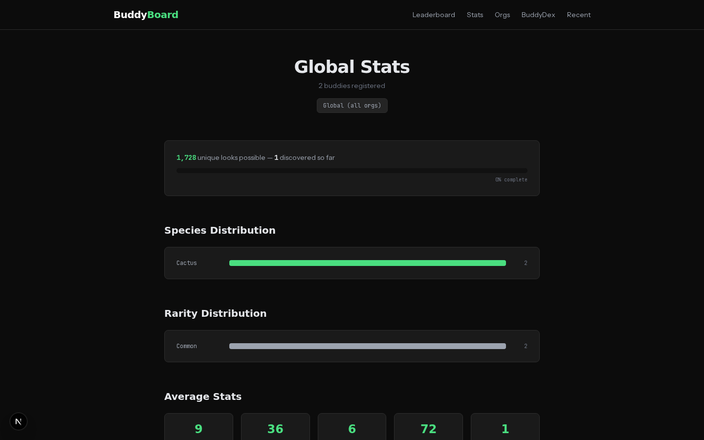

```
                .----.
               ( *  * )    B U D D Y  B O A R D
               (      )    
                `----´     Competitive leaderboard & trading cards
               ~~~~~~~     for Claude Code /buddy companions
```

[](https://www.npmjs.com/package/buddy-board)
[](LICENSE)
[](https://buddyboard.xyz)

---

### Demo

https://github.com/user-attachments/assets/buddy-board-promo

<a href="https://github.com/TanayK07/buddy-board/releases/download/v0.1.0/BuddyBoardPromo.mp4">
  
</a>

<sup>Click to watch the full promo video</sup>

---

## Get Started

Just run this — it walks you through everything interactively:

```bash
npx buddy-board
```

```
  buddy-board
  Submit your Claude Code companion to the leaderboard.

  Username (3-20 chars, lowercase): tanayk07
  GitHub (optional, Enter to skip): TanayK07
  Org (optional, Enter to skip): originautonomy

  Reading Claude Code config... ok
  Computing buddy data... ok
  Verifying @TanayK07... verified
  Submitting... ok

  ┌──────────────────────────────────────────────┐
  │ ***** LEGENDARY                      DRAGON  │
  │                                              │
  │   /^\  /^\       Inferno                     │
  │  <  *  *  >                                  │
  │  (   ~~   )                                  │
  │   `-vvvv-'                                   │
  │                                              │
  │  DEBUGGING   ████████████░░░  92             │
  │  PATIENCE    ████████░░░░░░░  55             │
  │  CHAOS       █████████████░░  88             │
  │  WISDOM      ███████████░░░░  78             │
  │  SNARK       █████████░░░░░░  65             │
  │                                              │
  │  @mythicdev              Total: 378          │
  └──────────────────────────────────────────────┘

  Submitted successfully.

  View  https://buddyboard.xyz/u/tanayk07
  Card  https://buddyboard.xyz/card/tanayk07
  Team  https://buddyboard.xyz/org/originautonomy
```

Requires Node.js 18+. If you use Claude Code, you already have it.

---

## Screenshots

<table>
  <tr>
    <td></td>
    <td></td>
  </tr>
  <tr>
    <td><em>Home — Featured cards + leaderboard with org/species/rarity filters</em></td>
    <td><em>Profile — Trading card with stats, rankings, share + embed codes</em></td>
  </tr>
  <tr>
    <td></td>
    <td></td>
  </tr>
  <tr>
    <td><em>BuddyDex — Pokedex-style species gallery, undiscovered = silhouettes</em></td>
    <td><em>Stats — Hall of fame, distributions, fun facts, combo tracker</em></td>
  </tr>
</table>

---

## Features

**Leaderboard** — Global rankings sorted by total stats. Filter by species, rarity, and organization.

**BuddyDex** — Pokedex-style gallery of all 18 species. Undiscovered species show as silhouettes. Track which of the 1,728 possible combos have been found.

**Trading Cards** — Every buddy gets a card with rarity-specific visual treatments:

```
  Common     ─  clean border
  Uncommon   ─  green border  
  Rare       ─  blue glow
  Epic       ─  purple glow
  Legendary  ─  gold pulse + holographic shimmer + scanlines
```

**Organizations** — Team dashboards at `/org/your-org`. See your org's leaderboard, species coverage, and combined stats. Join with `--org` flag.

**Compare** — Side-by-side buddy comparison at `/compare/user1/user2`. Stat-by-stat breakdown with win/loss indicators.

**Share** — One-click share to X with auto-generated OG card (1200x675). Copy-to-clipboard on all embed codes.

**Embeddable Cards** — For your GitHub README:

```markdown
# Full card
[](https://buddyboard.xyz/u/yourname)

# Compact badge
[](https://buddyboard.xyz/u/yourname)
```

---

## How It Works

Your buddy's species, rarity, stats, eyes, and hat are **deterministic** — computed from a hash of your Claude Code account ID using the [same algorithm](https://github.com/anthropics/claude-code) as Claude Code itself. Name and personality are AI-generated on first `/buddy` hatch.

```
~/.claude.json  →  hash(userId + salt)  →  Mulberry32 PRNG  →  species, rarity, stats
                                                              ↓
                                        CLI submits to Supabase via RPC
                                                              ↓
                                        Web renders leaderboard + trading cards
```

### The Numbers

| | |
|---|---|
| **Species** | duck, goose, blob, cat, dragon, octopus, owl, penguin, turtle, snail, ghost, axolotl, capybara, cactus, robot, rabbit, mushroom, chonk |
| **Rarities** | common (60%), uncommon (25%), rare (10%), epic (4%), legendary (1%) |
| **Eyes** | 6 types |
| **Hats** | 8 types (commons don't get hats) |
| **Shiny** | 1% chance |
| **Total combos** | 1,728 unique visual combinations |

---

## Tech Stack

| Layer | Tech |
|---|---|
| CLI | Node.js, zero dependencies, interactive prompts, ANSI colors |
| Web | Next.js 16 (App Router), Tailwind CSS v4, Vercel |
| Database | Supabase Postgres — RLS, bcrypt token auth, RPC functions |
| OG Cards | `@vercel/og` (Satori) — 1200x675 PNG generation |
| Fonts | Satoshi (display), Instrument Sans (body), JetBrains Mono (code) |
| Analytics | Vercel Analytics |

---

## Development

```bash
# CLI
cd cli && node index.js

# Web
cd web && npm install && npm run dev
# Requires .env.local with NEXT_PUBLIC_SUPABASE_URL and NEXT_PUBLIC_SUPABASE_ANON_KEY

# Tests
cd cli && node test.js
```

### Project Structure

```
buddy-board/
├── cli/                  # npx buddy-board — interactive CLI
│   ├── index.js          # Prompts, ANSI card rendering, submission
│   ├── roll.js           # Deterministic buddy algorithm (Mulberry32 PRNG)
│   ├── config.js         # Reads ~/.claude.json
│   └── submit.js         # Supabase RPC + GitHub/org verification
├── web/                  # Next.js web app
│   ├── app/              # 10 routes: home, profile, stats, dex, org, compare, recent, rarity, card, badge
│   ├── components/       # BuddyCard, LeaderboardTable, CopyButton, ShareButton, etc.
│   └── lib/              # Types, queries, sprites, constants
├── supabase/             # 3 SQL migrations (buddies, github fields, orgs)
└── video/                # Remotion promo video project
```

---

## License

MIT
